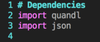

# Assumptions for Activities 1-3
* Students already got Quandl API Key
* Students are familiar with pandas 
* Students installed quandl library using `pip install quandl`

### 4. Students Do: Get Stock Ticker Information
* In this activity students will use the Quandl API to get stock ticker
information
  * Open up [Activities/04-Stu_Get_Stock_Ticker/Solved/GetStockTicker_Solved.py](Activities/04-Stu_Get_Stock_Ticker/Solved/GetStockTicker_Solved.py)
  directory and demo the solved code
  * Tell students to find
  [Activities/04-Stu_Get_Stock_Ticker/Unsolved/GetStockTicker_Unsolved.py](Activities/04-Stu_Get_Stock_Ticker/Unsolved/GetStockTicker_Unsolved.py)
   on git or Slack out unsolved starter code

* **Files**:
  * [Activities/04-Stu_Get_Stock_Ticker/Solved/GetStockTicker_Solved.py](Activities/04-Stu_Get_Stock_Ticker/Solved/GetStockTicker_Solved.py)
  * [Activities/04-Stu_Get_Stock_Ticker/Unsolved/GetStockTicker_Unsolved.py](Activities/04-Stu_Get_Stock_Ticker/Unsolved/GetStockTicker_Unsolved.py)

* **Instructions**: [Activities/04-Stu_Get_Stock_Ticker/README.md](Activities/04-Stu_Get_Stock_Ticker/README.md)
  * Import necessary libraries to interact with Quandl API  
  * Import keys from config file  
  * Setup Quandl authentication  
  * Write code to fetch the Apple Stock Ticker  
  * Write code to fetch stock prices from multiple stocks
  * Loop through and print last 5 closing prices  

* **Hint**:
  * Consult Quandl documentation for the method used to accomplish this task

### 5. Instructor Do: Review Get Stock Ticker Information

* Send students the Solved code
* Open code and walk through sections
  * Explain that python gets external code using the import keyword  
   
  * Show how the API key can also be imported from the config file  
   
  * Explain how the API key is set in the Quandl library. Be sure to
  note that this will differ depending on the library  
   
  * Show how the quandl python library has a get method that can grab
   tickers that match the websites format  
  * Be sure to explain how the quandl library automatically converts the
  the api response into a Pandas dataframe under the hood for the users
  convenience
   
  * Lastly show how loops can be used in conjunction to make
  multiple API calls for a list of companies
   
